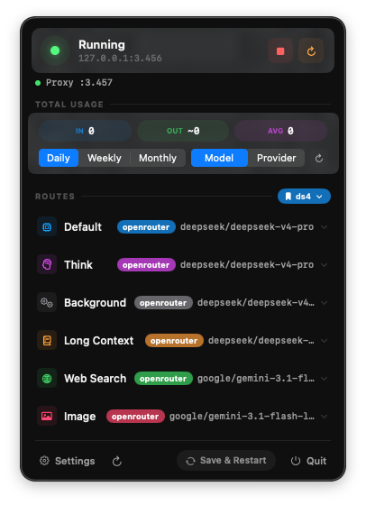
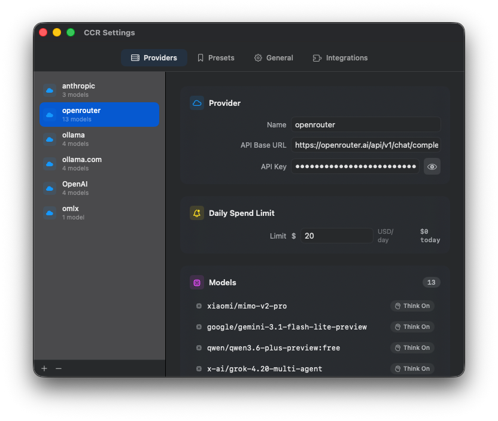

# CCR Menu Bar

A native macOS menu bar application for managing [Claude Code Router (CCR)](https://github.com/musistudio/claude-code-router). Start, stop, and configure your CCR instance without touching the terminal.

<p align="center">
  
</p>


## What is Claude Code Router?

[Claude Code Router](https://github.com/musistudio/claude-code-router) is a proxy that sits between Claude Code and multiple AI providers, allowing you to route different types of requests (default, thinking, background, long context, web search, image) to different models and providers. CCR Menu Bar gives you a GUI to manage it all.

## Features

## Screenshots

| Menu Bar Popup | Settings |
| --- | --- |
|  |  |

### Menu Bar Control
- Live server status indicator (green = running, white = stopped)
- One-click Start / Stop / Restart
- Auto-detects `ccr` binary from nvm, homebrew, bun, and common paths
- Status polling every 10 seconds via PID file check with HTTP fallback

### Route Management
- Visual display of all 6 router routes: **Default**, **Think**, **Background**, **Long Context**, **Web Search**, **Image**
- Searchable model picker — type to filter; providers and models sorted alphabetically
- **Presets** — save, switch, update, and delete named route configurations from the popup
- **Save & Restart** applies config changes and restarts the server in one action

### Proxy Service & Per-Session Routing
- Built-in HTTP reverse proxy on **port 3457** sits between Claude Code and CCR
- Routes requests to the correct CCR preset path without restarting CCR
- Per-session isolation: each terminal window gets its own session token via `CCR_SESSION`
- Proxy status and active preset shown in the main popup

### Claude Code Integration (auto-managed via Integrations tab)
- **`ccm:` hook** — intercepts `ccm:`, `ccm:list`, and `ccm:<name>` at the Claude Code prompt for instant preset switching without slash commands
- **MCP Server** — zero-dependency Node.js MCP server (`switch_preset`, `list_presets`, `current_preset` tools) written to `~/.claude-code-router/ccr-mcp-server.js`
- **Shell Setup** — idempotent block written to `~/.zshrc` (or `~/.bash_profile`, `config.fish`) setting `ANTHROPIC_BASE_URL` and `CCR_SESSION`

### Token Usage Tracking
- Parses CCR log files to estimate token consumption
- Shows input tokens, estimated output tokens, and request count
- Per-provider breakdown with top models by usage
- Today's stats with all-time fallback
- Auto-refreshes every 30 seconds

### Settings Window
- **Providers Tab**: Add/remove providers, configure API base URLs, API keys (masked), manage models, and assign transformers from 17 built-in options
- **General Tab**: Server host/port, API timeout, proxy URL, Claude binary path, API key, logging level, long context threshold, and launch-at-login toggle
- **Integrations Tab**: One-click install/uninstall for the `ccm:` hook, MCP server, and shell RC configuration

### Additional
- Real-time config file watching (detects external changes)
- Atomic config writes with race condition protection
- Preserves unknown JSON fields during config round-trips
- No Dock icon (menu bar only)

## Requirements

- **macOS 14.0** (Sonoma) or later
- **Claude Code Router** installed and accessible in PATH
- **Xcode 16+** and **XcodeGen** (for building from source)

## Installation

### Download Release

Download the latest `CCR.Menu.Bar.zip` from [Releases](../../releases), unzip it, move `CCR Menu Bar.app` to `/Applications`, and launch.

Release builds are for Apple Silicon Macs running macOS 14.0 or later. If macOS blocks the app because it was downloaded from the internet, open **System Settings → Privacy & Security** and choose **Open Anyway** for CCR Menu Bar.

### Build from Source

1. Install [XcodeGen](https://github.com/yonaskolb/XcodeGen) if you don't have it:
   ```bash
   brew install xcodegen
   ```

2. Clone and build:
   ```bash
   git clone https://github.com/srknzcn/ccr-menu-bar.git
   cd ccr-menu-bar
   chmod +x build-app.sh
   ./build-app.sh
   ```

3. The app will be at `build/CCR Menu Bar.app`. To install:
   ```bash
   cp -r "build/CCR Menu Bar.app" /Applications/
   ```

Alternatively, generate the Xcode project and build from Xcode:
```bash
xcodegen generate
open CCRMenuBar.xcodeproj
```

## Usage

1. **Make sure CCR is installed** — the app needs the `ccr` command available in your PATH
2. **Launch CCR Menu Bar** — a branch icon appears in your menu bar
3. **Click the icon** to open the popup:
   - View server status and start/stop the server
   - See token usage statistics
   - Change route assignments (click any route row → searchable model picker opens)
   - Click **Save & Restart** to apply route changes
4. **Open Settings** to configure providers, API keys, server options, and more
5. **Settings → Integrations** to install the `ccm:` hook, MCP server, and shell environment in one click

See [SETUP.md](SETUP.md) for a full installation and configuration walkthrough.

## Project Structure

```
CCRMenuBar/
├── CCRMenuBarApp.swift          # App entry point, menu bar setup
├── Info.plist                   # App metadata (LSUIElement, category)
├── CCRMenuBar.entitlements      # Network + hardened runtime
├── Models/
│   ├── CCRConfig.swift          # Config data model
│   ├── CCRPresetManifest.swift  # CCR preset directory manifest model
│   ├── RouterRoute.swift        # Route type definitions
│   └── AnyCodable.swift         # Preserves unknown JSON fields
├── Services/
│   ├── ConfigManager.swift      # Read/write/watch config file
│   ├── ServerManager.swift      # Start/stop/status management
│   ├── TokenUsageService.swift  # Log parsing & token estimation
│   ├── PresetManager.swift      # Preset CRUD + CCR directory sync
│   ├── ProxyService.swift       # HTTP reverse proxy (port 3457)
│   └── MCPInstaller.swift       # Writes hook, MCP server, shell config
├── Views/
│   ├── MenuBarPopup.swift       # Main popup layout
│   ├── ServerStatusView.swift   # Status indicator + controls
│   ├── RouterSection.swift      # Route rows with searchable model picker
│   ├── TokenUsageView.swift     # Usage stats display
│   ├── PresetPicker.swift       # Preset dropdown in popup header
│   ├── SettingsView.swift       # Settings window container + tab bar
│   ├── GeneralTab.swift         # General settings tab
│   ├── ProvidersTab.swift       # Provider management tab
│   └── IntegrationsTab.swift    # Hook / MCP / shell setup tab
└── Resources/
    └── Assets.xcassets/         # App icon assets
```

## Configuration

The app reads and writes `~/.claude-code-router/config.json` — the same config file used by CCR's CLI. Any changes made in the GUI or via CLI are automatically detected.

## How Token Tracking Works

Since CCR doesn't expose a usage API, the app parses CCR's pino-format log files from `~/.claude-code-router/logs/`. Input tokens are estimated from request message sizes (~3 chars per token), and output tokens are estimated from response times (~50 tokens/sec). Values are approximate and prefixed with `~` in the UI.

## Contributing

Contributions are welcome! Please open an issue or submit a pull request.

## License

MIT
